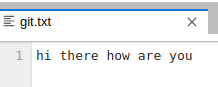
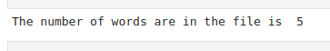

# Word-count
## AIM:
To write a python program for getting the word count from a text.
## EQUIPEMENT'S REQUIRED: 
PC
Anaconda - Python 3.7
## ALGORITHM: 
### Step 1:

### Step 2: 
 
### Step 3: 

### Step 4:  

### Step 5: 

### Step 6: 

## PROGRAM:
```developed by : S.E.Elamaran
reference number: 22000420
num=0
with open("git.txt","r") as f1:
    for i in f1:
        word=i.split()
        num += len(word)
print("The number of words are in the file is ",num)
```
### OUTPUT:




## RESULT:
Thus the program is written to find the word count from a text.
